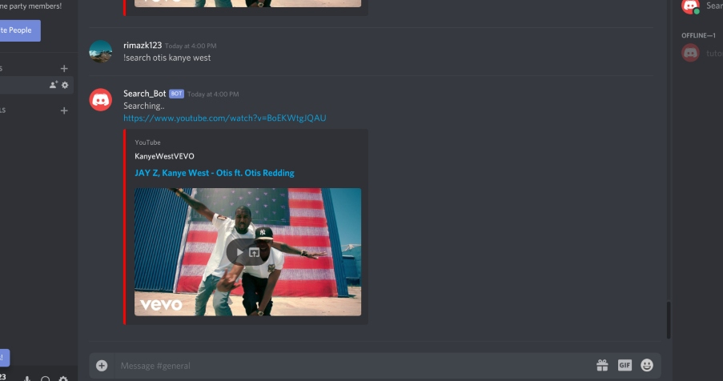

# YT-Search Bot

A discord bot that returns a url to a youtube video based on that keyword. Uses discord and youtube APIs. 

## Setup
```bash 
git clone https://github.com/rimazk123/ytSearchBot
```

## Usage

Put your credentials in a .env file

```bash
npm start
```

Type the command and a result should be returned

